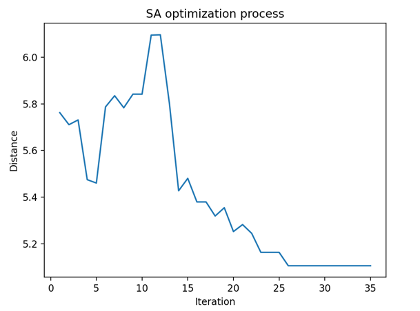
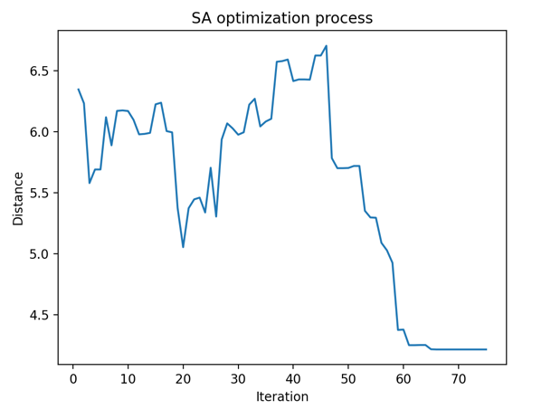
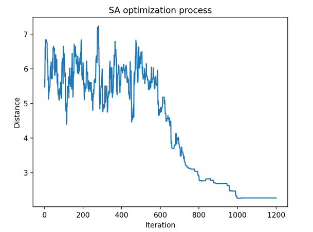
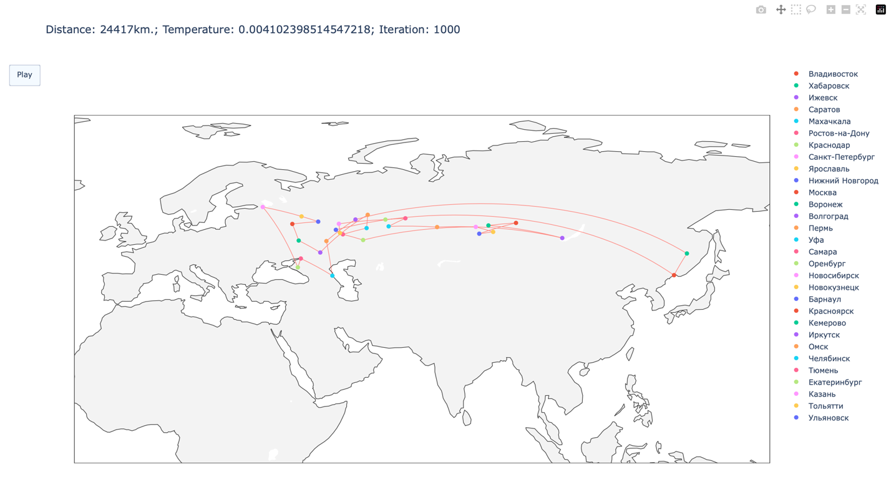
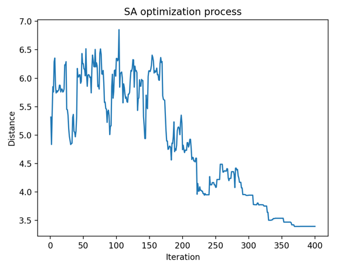

# Report
https://github.com/igudesman/salesman_problem

### Description
The script finds the optimal traveling salesman path using SA for 30 most populated cities. Every two iterations the cooling is applied. The initial parameters are:
* Temperature = 100.0
* Cooldown coefficient = 0.95
* Iterations = 400

### Optimization results
* Fast cooling (cooldown coefficient = 0.45, iterations = 35): .

At low temperatures, SA optimization is reduced to a simple climbing algorithm using a greedy policy. Since cooling is fast the SA algorithm is stuck in local optima. The best distance is 5.01*10^5 km.
* Middle cooling (cooldown coefficient = 0.75, iterations = 70): .

With middle cooling the SA algorithm managed to avoid a few local optima. The best distance is 4.2*10^5 km.
* Slow cooling (cooldown coefficient = 0.98, iterations = 1200): .

With slow cooling the SA algorithm achieved the best results 2.26*10^5 km. Therefore, slow cooling increases optimization search space allowing SA to avoid local optima. However, there is a tradeoff between time and optimization accuracy.

### How to run
* Go to `src/config.py`
* Configure `T`, `COOLDOWN`, `N`, `MODES`, `DEBUG`
* Run `src/main.py`

Modes:
* `TRAVELLING_PATHS_PLOT` provides animated visualization of travelling path optimization: 
* `OPTIMIZATION_PROCESS_PLOT` provides simple plot of optimization process: